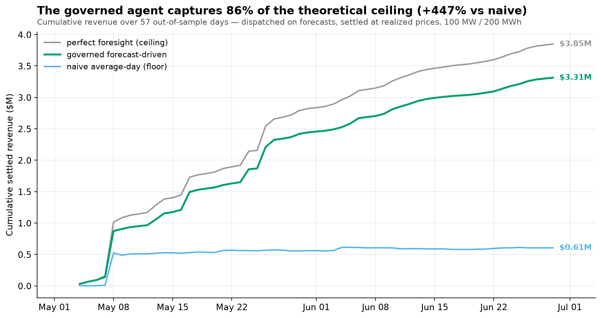
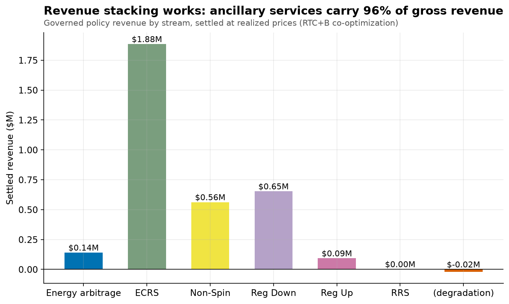
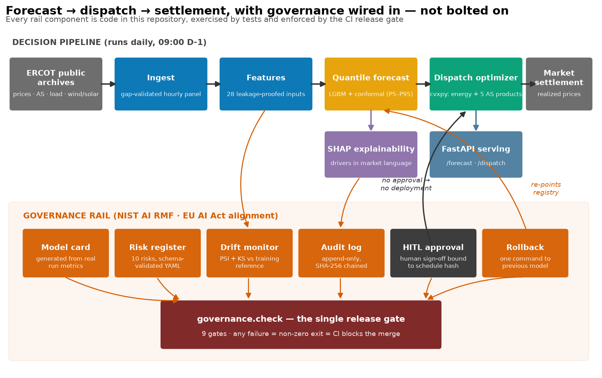

# Forecast-to-Dispatch

**A governed autonomous agent that forecasts wholesale power prices, dispatches a grid-scale battery, and proves — with enforceable release gates — that its revenue numbers can be trusted.**

Real ERCOT market data. Real trained models. Revenue settled at the prices that actually happened. Governance you can execute, not read about.

---

## The business case

Grid-scale batteries have become system-critical assets in ERCOT, but their revenue does not come from average prices — it comes from **spreads** and from a handful of **scarcity hours**. In the study window of this project, real-time prices at the Houston hub averaged $27/MWh yet peaked at **$3,049/MWh**; the top **1% of hours carried 18% of all price value**. A battery that is charged before the right evenings — and rents out its idle megawatts as ancillary reserves in between — earns multiples of one that follows the average day.

Two problems stand between that opportunity and an investable strategy:

1. **Forecasting the distribution, not the average.** The hours that pay are exactly the hours a point forecast misses. What's needed is a calibrated *range* of outcomes — especially an honest upper tail.
2. **Trust.** Storage backtests routinely overstate revenue by letting the model "know" the future (leakage) or by optimizing and settling on the same forecast. And an autonomous agent allocating real capital raises the questions every risk committee, ISO, and — increasingly — AI regulator now asks: *who approved this decision, from what inputs, under which model version, and how do we roll it back?*

This repository solves both, end to end, and makes the solution inspectable.

## What this project achieved — the numbers

**Headline: the governed agent captured 86.1% of the theoretically available value — $3.31M in settled revenue over 57 out-of-sample days — while every schedule was committed the morning before, on forecasts alone.**



| Result | Number | Where it's proven |
|---|---|---|
| Settled revenue, governed agent (57 days, 100 MW / 200 MWh) | **$3.31M** | fig07, notebook 05 |
| Revenue capture vs perfect-foresight ceiling ($3.85M) | **86.1%** | fig08 |
| Uplift vs naive average-day strategy ($0.61M) | **+447%** | fig07 |
| Ancillary services' share of gross revenue (RTC+B stacking) | **96%** | fig09 |
| Forecast improvement vs climatology (pinball loss) | **13% better** (7.55 vs 8.67) | fig14 |
| 90% interval honesty (after conformal calibration; raw model was 68%) | **86% empirical coverage** | fig02 |
| Scarcity hours flagged in advance by the P95 | **35%** of 17 events, incl. the $3,049 spike | fig05 |
| Regime drift caught by the monitor (summer arrival, net-load PSI) | **4.75** vs 0.2 threshold | fig11 |
| Release gates enforced in CI (any failure blocks the merge) | **9/9 passing** | fig12 |
| Tests, incl. a leakage truncation proof and physics assertions | **69** | `tests/` |



**And what it *proved*, beyond the numbers:**

- **Honest beats optimistic.** Dispatching on forecasts and settling at realized prices is the mechanism that separates an investable 86% from the fictitious ~100% that leaky studies report. The 14% gap to perfection is measured, attributed to forecast error, and concentrated in five spike days (fig10) — a roadmap for the next modeling dollar.
- **Co-optimization is the product, not a refinement.** An energy-only battery model would have left ~96% of this asset's gross revenue on the table. Reserve stacking under real clearing prices carried the quiet days; energy discharge took the spikes (fig22).
- **Simplicity won on evidence.** A deep-learning challenger (LSTM) was built behind the identical interface, calibrated identically, and lost on every metric (fig14). The governed choice is the explainable model — decided by measurement, not fashion.
- **Governance caught something real.** During the build, the drift monitor fired on the arrival of the Texas summer regime (PSI 4.75). The resolution is on display: an owner-signed, expiring acknowledgment tied to a named risk — the detect → decide → document loop working, not a threshold quietly retuned.

## Why this matters — and why now



Three timelines converged to make this the right project at this moment:

1. **ERCOT's RTC+B went live (December 2025).** Real-Time Co-optimization + Batteries makes co-optimized energy-plus-ancillary bidding *the* way storage value is captured in the largest battery market on earth. Every optimizer, asset owner, and grid-analytics vendor now needs exactly the decision loop modeled here: distributional price forecasts feeding a co-optimized dispatch under physical constraints.
2. **Storage is now system-critical.** ERCOT's battery fleet has grown past 10 GW and shapes evening scarcity pricing. The question investors ask has shifted from "can a battery make money?" to "**can I trust this revenue model?**" — and trust is a governance property, not a modeling property.
3. **AI-agent oversight became a legal requirement, not a slide.** The EU AI Act's obligations are phasing in through 2025–2027, and NIST AI RMF has become the de-facto U.S. reference. Both demand what most autonomous-agent demos lack: record-keeping, human oversight, monitoring, and rollback. This repository is a working reference implementation of those requirements applied to a real-money agent — every control is code with a test, enforced by a CI gate that exits non-zero.

**Who this is for:** battery/storage operators and optimizers evaluating RTC+B strategies; grid-modeling and energy-analytics teams looking for an honest backtesting pattern; and AI-governance practitioners who need a concrete, executable example of NIST AI RMF / EU AI Act alignment on an autonomous decision system.

## How to use it

**Five minutes, fully offline** (a real one-month ERCOT sample ships with the repo — no network, no API keys):

```bash
git clone https://github.com/alanmossinger/forecast-to-dispatch
cd forecast-to-dispatch
python -m venv .venv && . .venv/bin/activate   # Windows: .venv\Scripts\activate
pip install -e ".[dev]"

# the whole decision loop: ingest -> features -> forecast -> dispatch -> backtest -> governance
python scripts/run_pipeline.py --sample

# the release gates (the same command CI runs; non-zero exit = release blocked)
python -m forecast_to_dispatch.governance.check --sample
```

**Read the story** (each notebook is executed with real outputs, every figure interpreted):

| Notebook | What it shows |
|---|---|
| `01_market_eda` | Where battery revenue actually lives (tails, evening window, episodic scarcity) |
| `02_features_leakage` | What the model may know at bid time — and the proof it can't cheat |
| `03_forecasting_lgbm_vs_lstm` | Calibrated quantile forecasts; the LSTM losing honestly; SHAP in market language |
| `04_dispatch_optimization` | The co-optimized schedule; physics as hard constraints; LP-vs-MILP |
| `05_backtest_revenue` | The money story: 86.1% capture, decomposed and stress-read |
| `06_governance_walkthrough` | Live demos: audit-chain tampering caught, HITL enforcement, rollback |

**Serve it** (governance enforced over HTTP — deployment without human approval returns 403):

```bash
uvicorn forecast_to_dispatch.serve.api:app --port 8000
curl -X POST localhost:8000/dispatch -H "Content-Type: application/json" \
     -d '{"day": "2024-05-30", "deploy": true}'        # -> 403 until /approve
```

**Reproduce the full study** (live pulls from ERCOT's public archives via `gridstatus`; free, no credentials):

```bash
python -m forecast_to_dispatch.data.ingest --start 2024-01-01 --end 2024-06-30 --make-sample
python scripts/run_pipeline.py --stages features forecast dispatch backtest governance
```

Deep-dive documents: **[reports/RESULTS.md](reports/RESULTS.md)** (all 24 figures with business interpretations), **[reports/EXPLAINER.md](reports/EXPLAINER.md)** (the non-coder walkthrough), **[governance/model_card.md](governance/model_card.md)** (the model's generated passport), **[governance/risk_register.md](governance/risk_register.md)** (10 risks with owners and mitigations).

## Architecture and honesty rules (below the fold)

```
data/ingest        ERCOT DAM + RTM settlement point prices, 5 AS clearing prices,
                   load/wind/solar — public archives, gap-validated, cached
features/build     28 features, each with a DECLARED minimum legal lag vs the
                   09:00 D-1 issue time; truncation experiment proves no leakage
forecast/          LightGBM quantile regression (P5..P95) + width-scaled conformal
                   calibration; LSTM challenger behind the same interface; SHAP
optimize/dispatch  cvxpy price-taker LP co-optimizing energy + RegUp/RegDn/RRS/
                   NonSpin/ECRS under SOC dynamics, headroom, energy-backing,
                   degradation cost; auto MILP escalation (HiGHS) on negative prices
backtest/engine    walk-forward: DECIDE on forecasts, SETTLE at realized prices;
                   perfect-foresight ceiling + naive floor for honest scaling
governance/        model card (generated), risk register (schema-checked), PSI/KS
                   drift monitor, hash-chained append-only audit log, HITL approval
                   bound to schedule hashes, one-command rollback, 9 release gates
serve/api          FastAPI: /health /forecast /dispatch /approve; audit middleware;
                   registry resolved per request (rollback is live)
```

Non-negotiables enforced in code: every feature knowable at bid time (tested by blinding the future); dispatch decisions never see realized prices; settlement never sees forecasts; a schedule without a named human approval is not deployable; the audit log cannot be silently edited; a model that fails any gate cannot merge.

**Known limitations** (full list in the model card): exogenous drivers are lagged actuals because ERCOT's historical *forecast* archives expire — results are a conservative floor; single hub, single season (Jan–Jun 2024); reserves settle on capacity without deployment modeling; price-taker assumption.

---

*Built for ERCOT's RTC+B era: distributional forecasting feeding co-optimized energy + ancillary dispatch. Governance aligned to NIST AI RMF (Govern/Measure/Manage) and EU AI Act expectations for record-keeping, human oversight, and post-market monitoring — implemented as executable, CI-enforced controls.*
