# Results — the market story in figures

*One narrative: the market problem → how well we forecast (especially the tails) → the revenue the governed agent captures → proof it is governed. Every figure below is embedded with a 3–5 sentence interpretation ending in a business consequence. Figures are produced by real runs on real data — no number here is invented.*

> Status: populated phase by phase. Sections appear as their figures land.

---

## 1. The market problem

*Data: ERCOT settlement point prices at HB_HOUSTON, Jan 1 – Jun 29 2024 (4,343 hours), from ERCOT's public historical archives via `gridstatus` — day-ahead (DAM) hourly SPP, real-time (RTM) 15-minute SPP averaged to hourly, and DAM ancillary-service clearing prices (Reg Up/Down, RRS, Non-Spin, ECRS).*

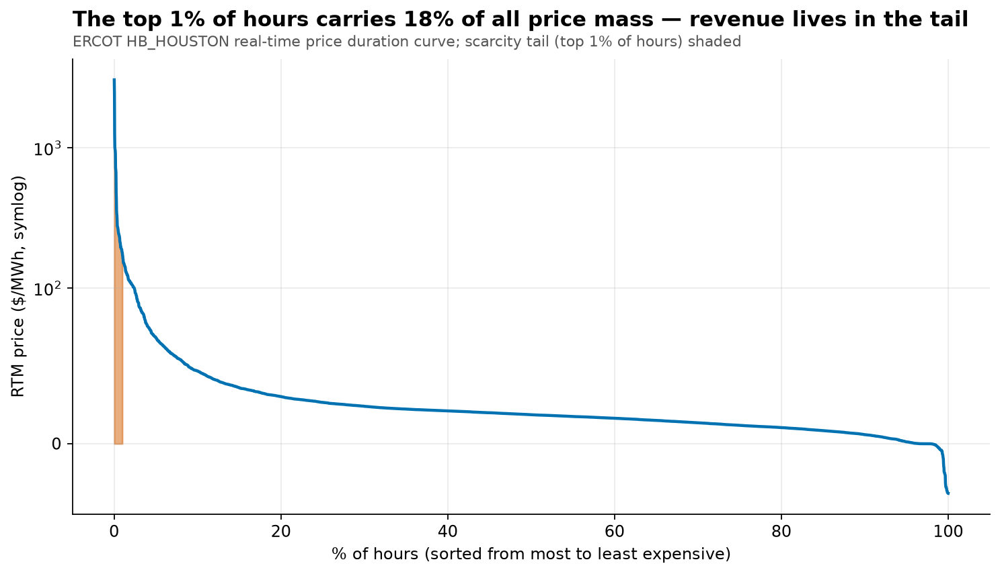

The real-time price averaged just $27/MWh over the half-year, but the top **1% of hours carried 18% of the entire price mass**, peaking at $3,049/MWh — a 112× multiple of the mean. The curve collapses to double digits within the first few percent of hours, which means a battery's annual P&L is decided in roughly two days' worth of scattered hours. **Business consequence:** the forecasting problem that pays is not average accuracy but tail positioning — this is why the system is evaluated on scarcity recall and interval calibration, not RMSE.

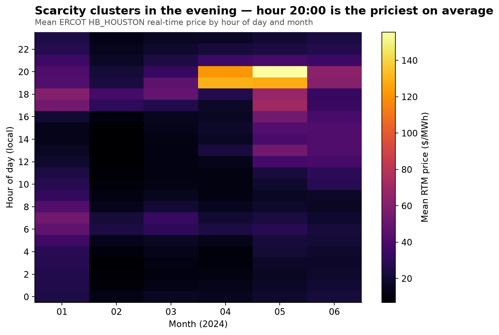

Expensive hours concentrate around **hour 20:00 local** — the early-evening net-load peak when solar fades while demand persists — and intensify toward summer. This regularity is the battery's friend: a 2-hour battery simply must be fully charged before this window opens. **Business consequence:** the dispatch optimizer should charge in the overnight/midday trough and discharge into this window; the backtest SOC heatmap (fig21) will verify that behavior systematically.

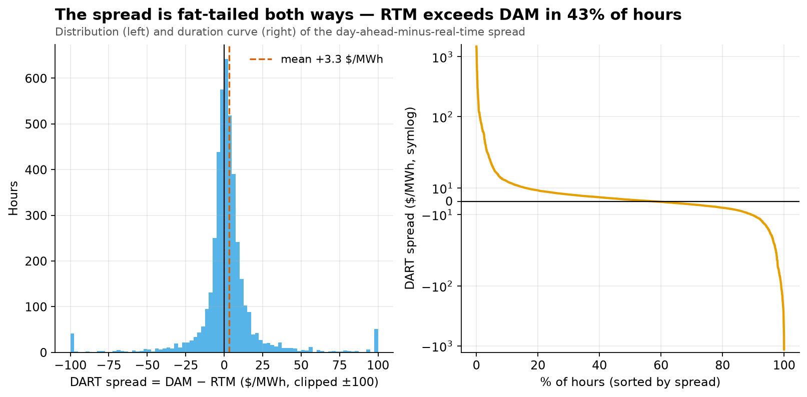

The day-ahead-minus-real-time (DART) spread averaged only **+$3.3/MWh** but with a $63/MWh standard deviation and heavy tails both ways; real time exceeded day-ahead in **43% of hours**. The near-zero mean hides that the downside tail (RTM ≫ DAM) is where scarcity lives and the upside tail is where an over-committed battery gets punished. **Business consequence:** the spread's width — not its mean — sets the arbitrage revenue ceiling, and its two-sidedness is why dispatch must be driven by a distributional forecast rather than a single expected price.

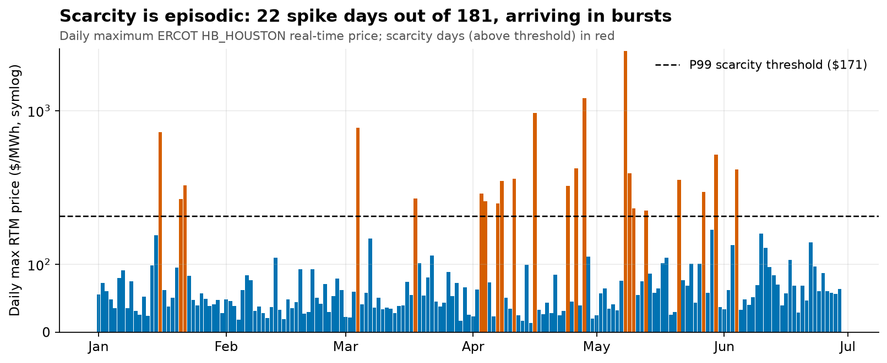

Only **22 of 181 days** produced an hour above the P99 scarcity threshold ($171/MWh), and they arrive in visible bursts — early April and early May clusters — separated by long calm stretches. Scarcity is regime-driven: weather, outages, and net-load stress land together. **Business consequence:** a model trained in a calm regime can silently lose tail sensitivity, which is exactly what the Phase 6 drift monitor is built to catch before it costs money; and an operator should evaluate this asset in paydays per season, not average daily revenue.

## 2. What the model is allowed to know

*Feature matrix: 4,128 forecastable hours × 28 leakage-safe features. Every forecast is issued at 09:00 on D-1 (before ERCOT's 10:00 DAM gate closure); every feature's minimum legal lag is declared in code (`FEATURE_SPEC`) and enforced by tests, including a truncation experiment that rebuilds a delivery day's features with the future blinded and asserts bit-identical output.*

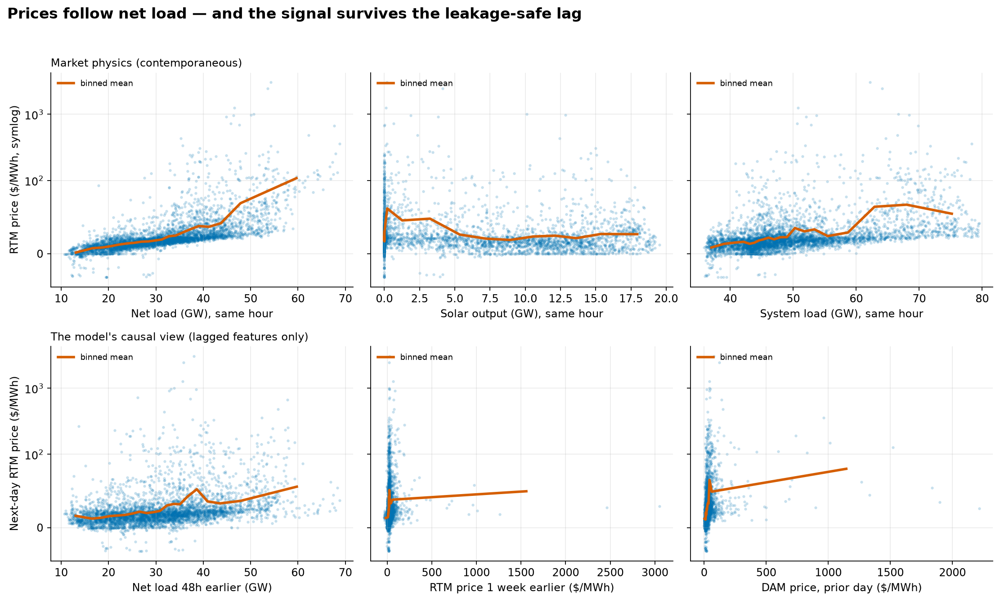

The top row shows the market physics the model must learn: real-time price rises with same-hour net load at Spearman ρ = **0.82**, with the classic scarcity nonlinearity — flat for most of the range, explosive in the top decile. The bottom row shows the same world through the only lens the model is allowed: net load 48h earlier still carries ρ = **0.45** against the next-day price, and the prior-day DAM price — the market's own published expectation — carries ρ = **0.54**. The signal weakens under the honesty constraint but survives. **Business consequence:** the gap between the two rows *is* the forecasting problem, and it is why the eventual revenue-capture number will sit meaningfully below the perfect-foresight ceiling — any storage backtest whose capture approaches 100% should be presumed leaky.

One deliberate limitation, recorded in the model card: ERCOT's historical day-ahead *forecast* archives (load/wind/solar) expire and cannot be reconstructed for 2024, so the model uses lagged actuals as persistence proxies — strictly weaker information than a production forecast feed. Reported results are therefore a **conservative floor**.

## 3. Forecast quality — especially the tails

*Protocol: chronological split — train Jan 9 → May 3 (2,760 hours), test May 4 → Jun 29 (1,368 hours, strictly the future). Both models conformally calibrated (width-scaled CQR) on the last quarter of the training window; scarcity threshold = training-window P99 ($166/MWh). All numbers from the registered real run (`models/*/metrics.json`).*

| Model | Pinball (mean) | 90% coverage | Scarcity recall (17 hrs) | P50 MAE |
|---|---|---|---|---|
| Climatology (no model) | 8.67 | 0.85 | 0.35 | $22.6* |
| **LightGBM (production)** | **7.55** | **0.86** | **0.35** | **$18.6** |
| LSTM (challenger) | 10.26 | 0.76 | 0.00 | — |

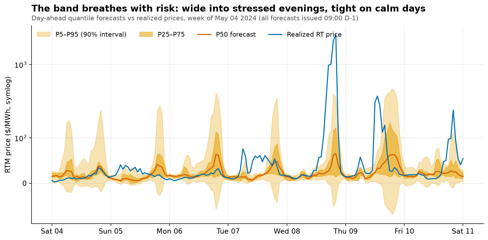

The quantile band *breathes*: tight through calm overnight hours, stretching by an order of magnitude into stressed evenings — including the May 8 event where realized prices hit $3,049/MWh. Band width is directly actionable for an operator: a wide P95 tomorrow evening is the signal to hold state-of-charge instead of selling reserves early. **Business consequence:** a point forecast carries none of this information; the fan is what makes risk-aware dispatch possible.

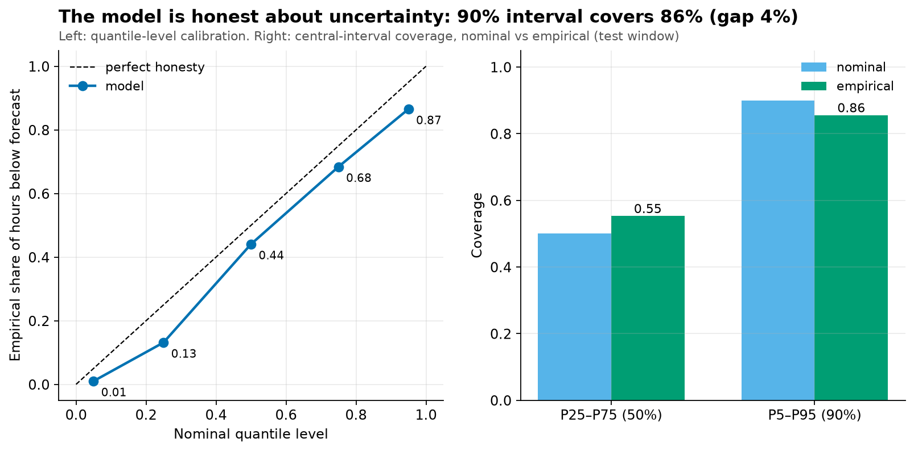

The honesty certificate: the stated 90% interval covered **86%** of test hours (within the ±8pp tolerance), the 50% interval 55%. This required conformal calibration — the raw model's "90%" interval covered only 68%, a confident lie that would systematically under-position the battery for tails. **Business consequence:** every risk decision downstream inherits this honesty; its drift is monitored in production (fig11).

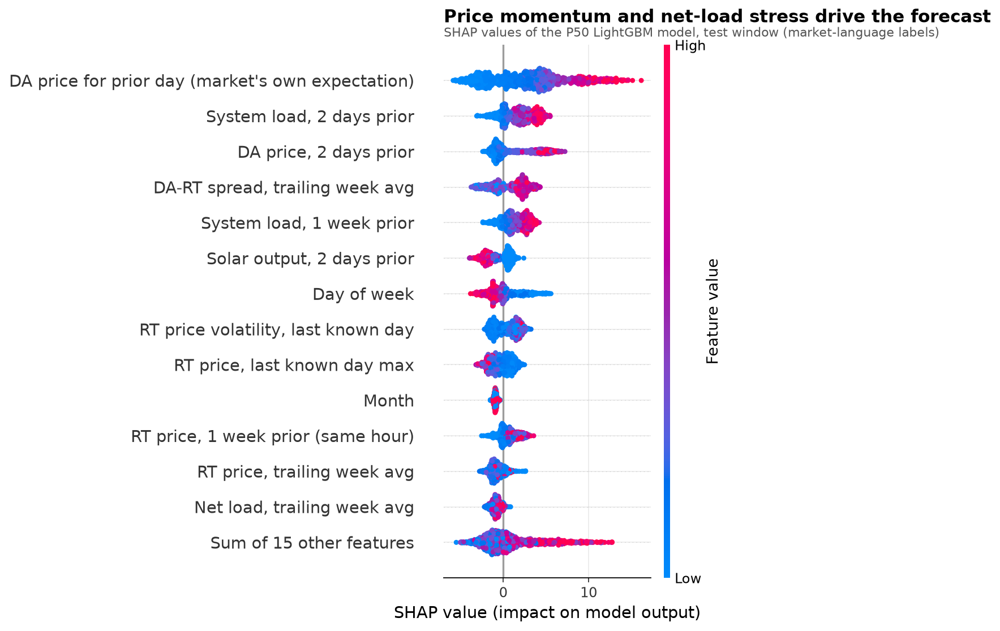
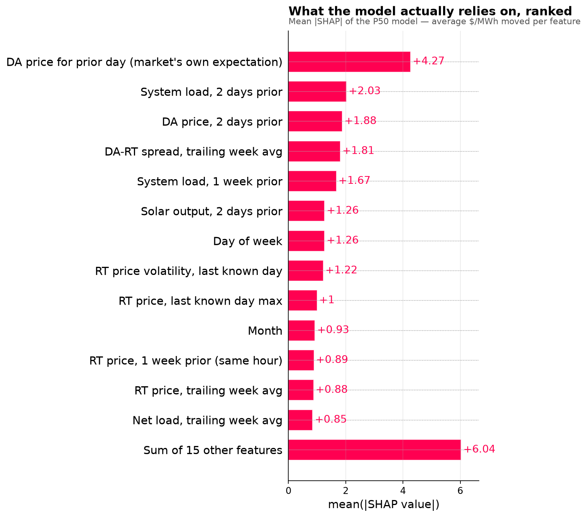

What the model relies on reads like a market desk's checklist: recent real-time price levels and volatility (regime/momentum), the prior-day DAM price (the market's own expectation), and net load / renewables (the physics of scarcity). Nothing in the top ranks is a mystery feature — an operator can challenge any forecast in market terms and get a coherent answer. **Business consequence:** this is what makes the human-in-the-loop gate a real review rather than a rubber stamp, and it is the transparency artifact an EU-AI-Act-style audit asks for.

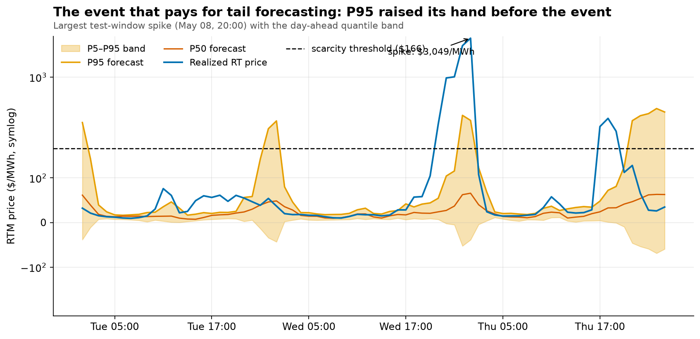

The single event that pays for tail forecasting: ahead of the largest test-window spike (May 8, 20:00, $3,049/MWh), the P95 issued the morning before **rose above the scarcity threshold** — the difference between a battery that entered that evening fully charged and one that sold out at noon. **Business consequence:** catching events of this class is the entire return on the probabilistic-forecasting investment.

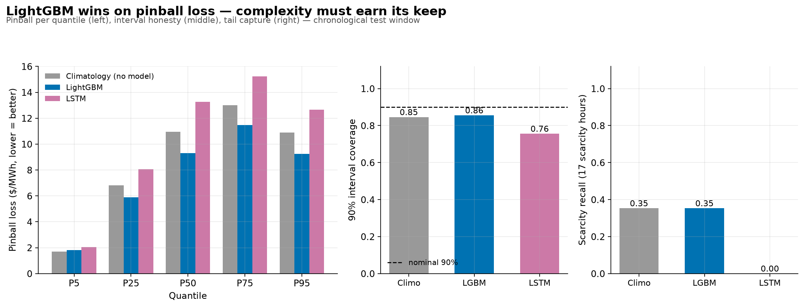

Does deep learning earn its complexity? A clean **no** on this dataset: the LSTM loses on pinball (10.26 vs 7.55), under-covers even after identical conformal treatment (76%), and its P95 flagged zero scarcity hours. With ~115 training days the sequence model lacks the data volume its parameters want. **Business consequence:** the governed choice is the simpler, faster, explainable model — chosen on evidence, not fashion. The LSTM remains registered as a challenger.

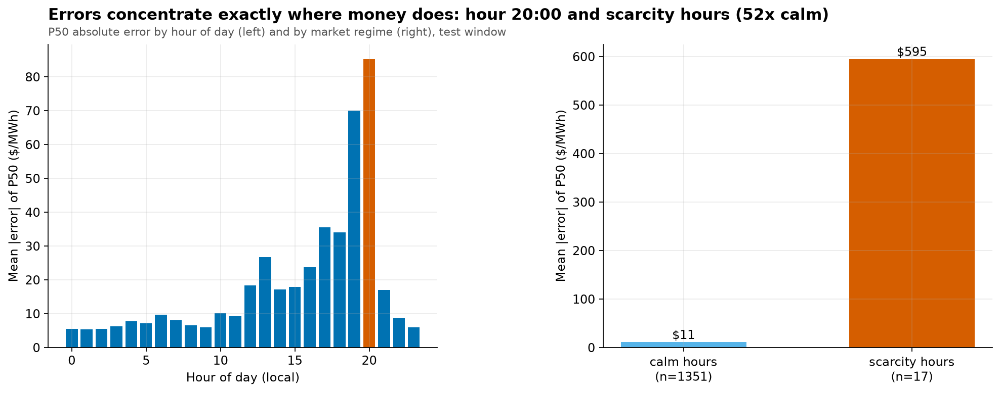

P50 errors concentrate in the evening ramp and explode in scarcity hours — exactly where the money is. **Business consequence:** this residual, honestly measured, is what the backtest prices as the gap between governed revenue and the perfect-foresight ceiling; a storage backtest claiming near-zero scarcity-hour error is leaking the future.

\* *Climatology P50 MAE computed for context; its pinball already includes it.*

## 4. From forecast to dispatch

*The decision-maker: a cvxpy linear program co-optimizing energy arbitrage and all five ERCOT ancillary products under state-of-charge dynamics (round-trip efficiency ≈ 0.92), power limits, reserve headroom + energy-backing constraints, a $2/MWh degradation cost, and a cyclic end-of-day SOC. The optimizer sees forecast prices only; simultaneous charge/discharge is auto-detected and eliminated by MILP escalation (HiGHS) — needed only under negative prices, as the spec predicted.*

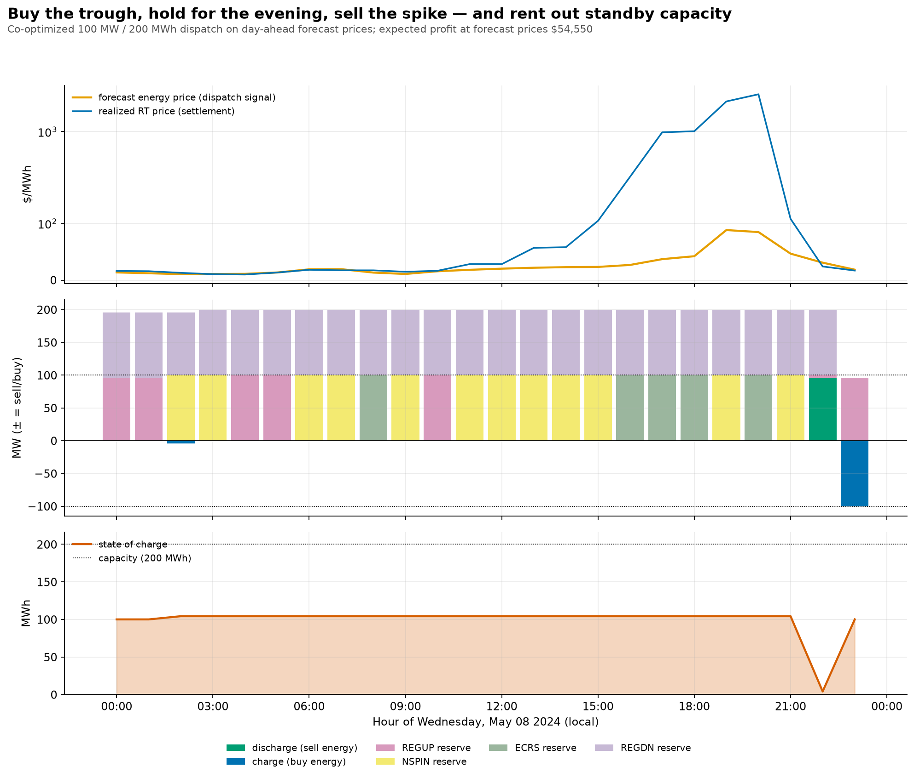

One day of decisions on the May 8 spike day, dispatched entirely on the day-before forecast: the battery rents its headroom as reserves nearly every hour (Reg-Down against the charge side; Non-Spin/ECRS/Reg-Up against the discharge side), holds ~100 MWh through the day, spends it into the evening window, and ends at its starting state of charge. Of the **$54,550** expected profit at forecast prices, **~99% came from ancillary services** — the RTC+B revenue-stacking thesis in one picture. Note the forecast (orange) caught the spike's *timing* but not its $3,049 magnitude; the battery still positioned correctly, and being right about *when* is what pays. **Business consequence:** an energy-only optimization would have left most of this day's value on the table; co-optimization is not a refinement, it is the product.

## 5. The money story *(Phase 5, pending)*

<!-- fig07_cumulative_revenue (headline), fig08_revenue_capture_bar, fig09_revenue_stack, fig10_cost_of_imperfection, fig21_soc_heatmap, fig22_reserve_allocation, fig23_monthly_revenue -->

## 6. Proof it is governed *(Phase 6, pending)*

<!-- fig11_drift_monitor, fig12_gate_status, fig13_architecture, fig24_audit_trail_flow -->
